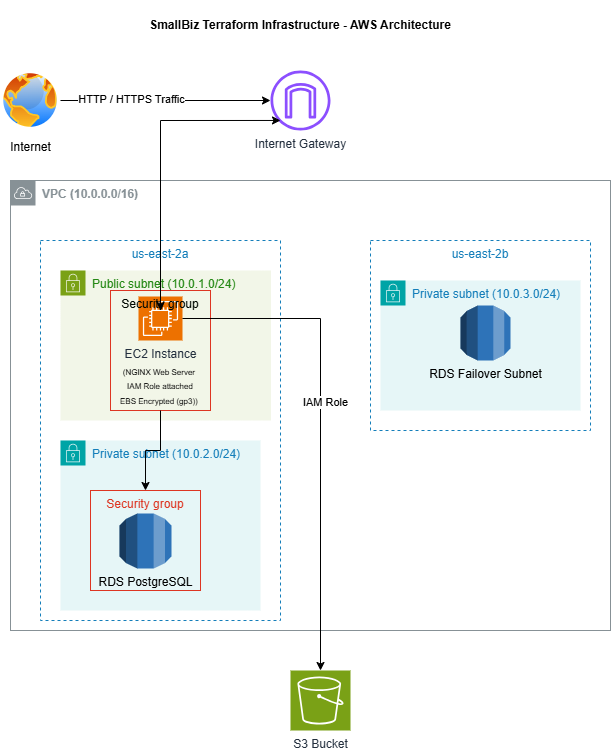

# Smallbiz-Terraform-Infrastructure
>A secure, multi-tier AWS environment built with Terraform for a small business web application.
This project covers real-world cloud architecture: networking, compute, database, storage, and identity, all provisioned as Infrastructure as Code.

---

## Architecture



Resources are deployed across two availability zones in us-east-2. The RDS DB subnet group spans both AZs laying the foundation for Multi-AZ failover in a production upgrade.

---

## What This Project Builds

| Service | Purpose |
|---|---|
| VPC | Isolated network environment for all resources |
| Public Subnet | Hosts the EC2 web server with internet access |
| Private Subnet 1 | Hosts the RDS database, no internet access |
| Private Subnet 2 | RDS failover subnet, required by AWS across two AZs |
| Internet Gateway | Entry and exit point for internet traffic |
| Route Tables | Controls traffic routing between subnets and internet |
| EC2 (NGINX) | Web server serving the application |
| RDS PostgreSQL | Database isolated in the private subnet |
| S3 Bucket | Stores logs, backups, and static files |
| IAM Role | Grants EC2 least privilege access to S3 |
| Security Groups | Controls inbound and outbound traffic per resource |


---

## Security Controls

Every layer of this environment has a security control applied to it.

**Network**
- RDS is placed in a private subnet with no route to the internet
- Security group referencing is used between EC2 and RDS. Port 5432 is only open to the EC2 security group ID, not to a broad CIDR block
- SSH access on port 22 is restricted to a single IP address only

**Compute**
- EC2 root volume is encrypted using EBS encryption (gp3)
- EC2 uses an IAM role, no access keys or hardcoded credentials anywhere

**Database**
- RDS storage is encrypted at rest
- Publicly accessible is set to false, the database has no public IP

**Storage**
- S3 bucket blocks all public access
- Server-side encryption enabled using AES256
- Versioning enabled to protect against accidental deletion or overwrites

**Identity**
- IAM policy is scoped to four actions only: GetObject, PutObject, DeleteObject, ListBucket
- Policy resource is locked to the specific S3 bucket ARN, not all S3 buckets

---

## Terraform Structure

```
smallbiz-terraform-infra/
├── provider.tf
├── main.tf
├── variables.tf
├── outputs.tf
├── terraform.tfvars.example
├── modules/
│   ├── vpc/
│   │   ├── main.tf
│   │   ├── variables.tf
│   │   └── outputs.tf
│   ├── ec2/
│   │   ├── main.tf
│   │   ├── variables.tf
│   │   └── outputs.tf
│   ├── rds/
│   │   ├── main.tf
│   │   ├── variables.tf
│   │   └── outputs.tf
│   ├── s3/
│   │   ├── main.tf
│   │   ├── variables.tf
│   │   └── outputs.tf
│   └── iam/
│       ├── main.tf
│       ├── variables.tf
│       └── outputs.tf
├── diagrams/
│   └── architecture.png
├── screenshots/
    └── README.md

 ```

---

## How to Deploy

### Prerequisites
- Terraform >= 1.0 installed
- AWS CLI installed and configured
- An EC2 key pair created in your AWS account

### Setup
```bash

git clone https://github.com/YOUR_USERNAME/smallbiz-terraform-infrastructure.git
cd smallbiz-terraform-infrastructure
cp terraform.tfvars.example terraform.tfvars

```
Edit `terraform.tfvars` with your own values:

```hcl
aws_region   = "us-east-2"

project_name = "sbti"

environment  = "dev"

key_name     = "your-key-pair-name"

my_ip        = "your.public.ip.address/32"

db_username  = "your-db-username"

db_password  = "your-db-password"

```

### Deploy

```bash

terraform init

terraform plan

terraform apply

```

### Verify

After apply completes, Terraform will output your EC2 public IP. Open it in a browser to confirm NGINX is serving traffic. You can also SSH into the instance and verify S3 access through the IAM role:

 ```bash

# Should succeed
aws s3 ls s3://YOUR_BUCKET_NAME

# Should be denied
aws s3 ls s3://any-other-bucket

```
### Destroy

```bash
terraform destroy
 ```
Destroy resources when finished to avoid unnecessary AWS charges. 

---

## Screenshots 

See the screenshots/ folder for evidence of all resources running including VPC, EC2, RDS, S3, IAM role, security groups, encryption settings, and least privilege verification.

---


